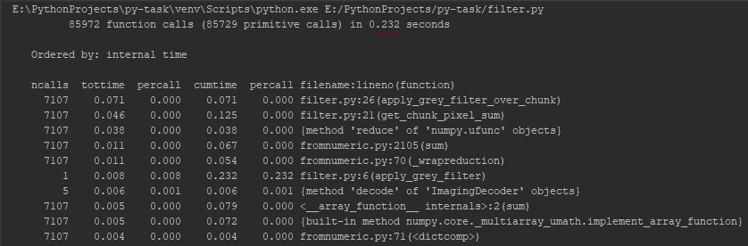
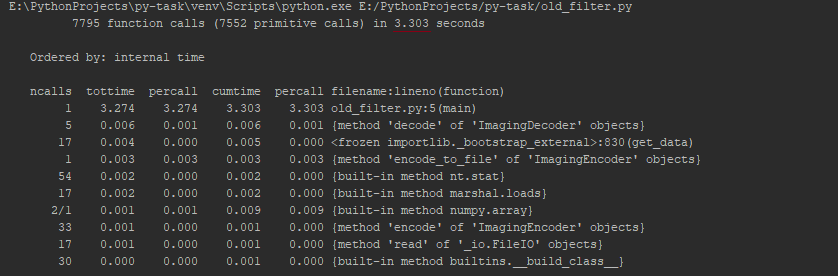
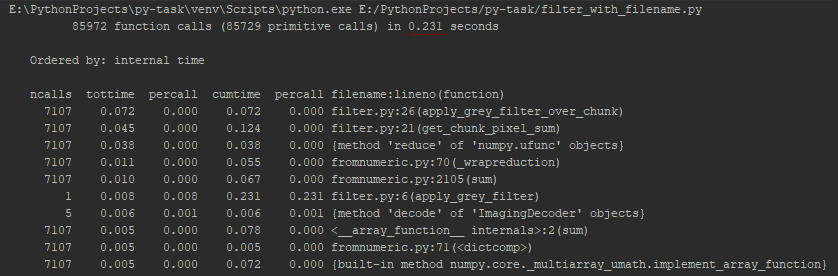
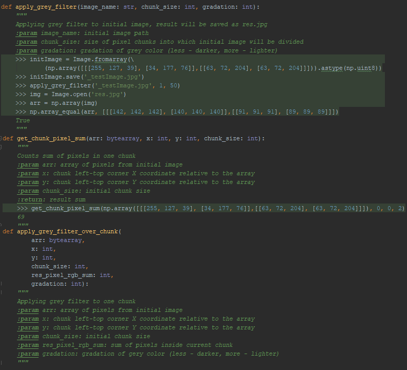
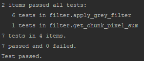
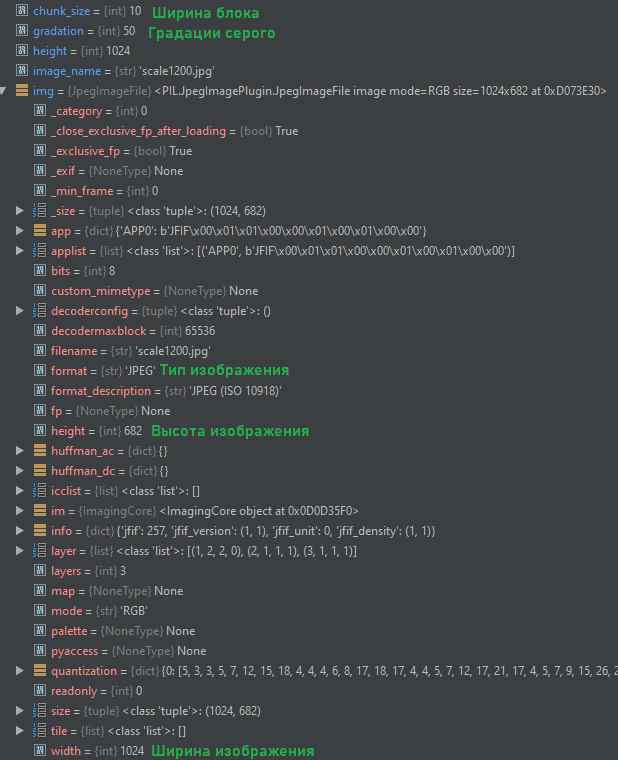

# Отчет по заданию
Профилирование новой программы, красным подчеркнуто полное время выполнения
(изначально профилирование не учитывает время ввода, это можно заметить по коду):\

Профилирование старой программы, красным подчеркнуто полное время выполнения:\

Профилирование новой программы с пресетом, красным подчеркнуто полное время выполнения:\

Различие во времени новой и старой программ объясняется использование в первой
математических методов работы с матрицами из модуля numpy, в отличие от обычной пробежки
циклами по всем пикселям изображения из старой программы\

Документация и doc-тесты в формате docstring:\

Результат doc-тестов:\

Требуемые по заданию свойства и значения в отладчике:\

